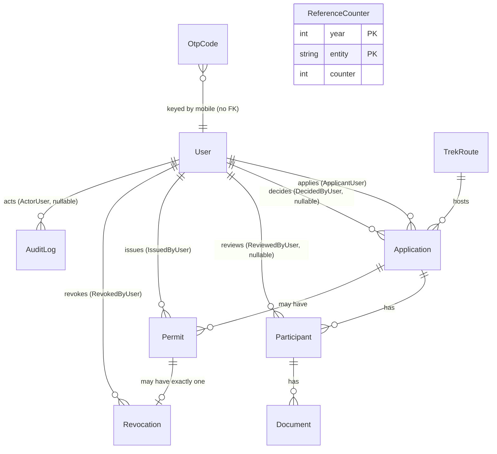
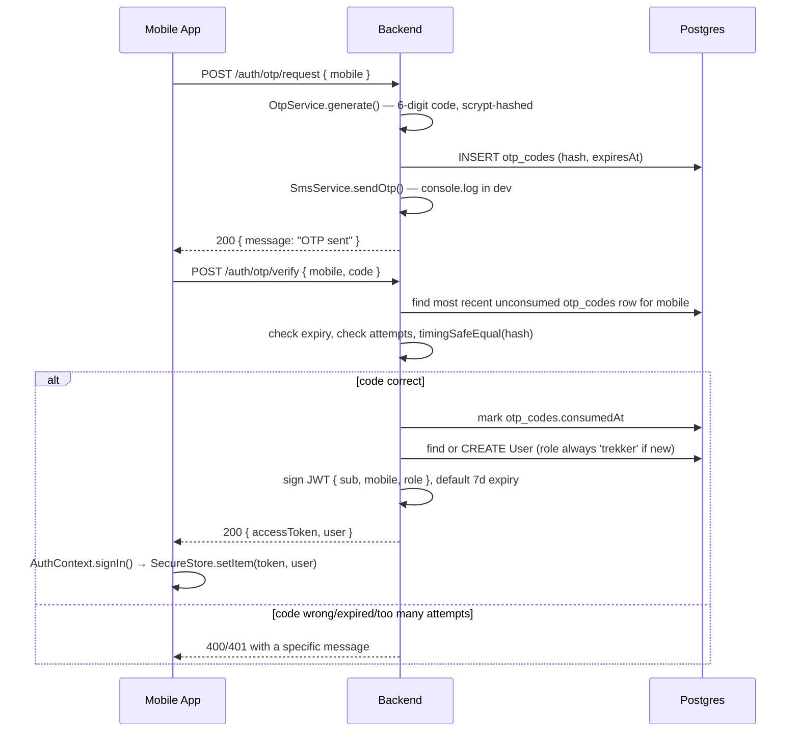
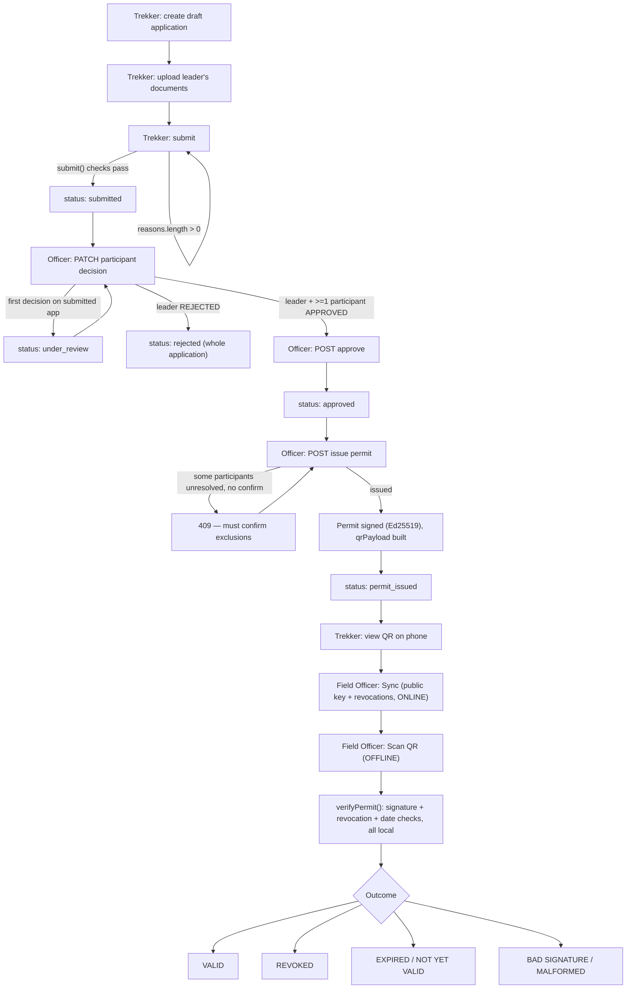
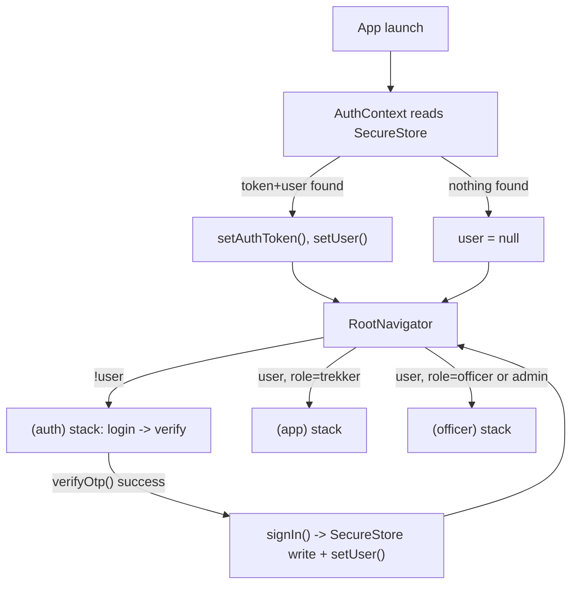

# Trek Permit — Project Architecture

This document is a complete map of the codebase as it exists today, written for a developer who has never seen this project. It was produced by reading every source file in `backend/` and `mobile/`, the full Prisma schema, both migrations, all config files, and the git history — not by guessing from file names.

Two labels are used throughout:

- **Confirmed from code** — directly observed in a file, cited by path.
- **Likely / inferred** — a reasonable conclusion the code supports, but not something the code states outright.

Nothing in this document is invented. Where something couldn't be determined, [Section 27](#27-unknowns--things-that-could-not-be-confirmed) says so explicitly instead of guessing.

---

## 1. Project Overview

**What it does.** Trek Permit is a system for issuing and verifying trekking permits for a pilot trek route in Jammu & Kashmir, for one season. A trekker applies online, uploads identity/fitness/photo documents, an officer reviews and approves the application, and the system issues a cryptographically signed permit encoded as a QR code. A second class of user — a Field Officer — scans that QR at a checkpoint and verifies it is genuine and unrevoked **with no network connection**, because checkpoints in this terrain often have no signal. That "must verify with zero connectivity" requirement (`docs/BUILD_SPEC.md` Section 1) is the single constraint that shapes the most distinctive parts of this codebase: how the permit is signed, what shape the QR payload takes, and why the mobile app carries its own local database.

**Who it's for.**
- **Trekkers** — apply for a permit, upload documents, view the issued QR.
- **Officers** — review applications, approve/reject/request corrections on individual participants, approve or reject the application as a whole, issue the signed permit.
- **Admins** — everything an officer can do, plus the one action officers cannot: revoking an already-issued permit.
- **Field Officers** — a separate mode of the same mobile app, for checkpoint staff who scan and verify permits offline.

**Main features (confirmed from code):**
- Mobile-number + OTP login, no passwords (`backend/src/auth`).
- Individual and group trek applications, with per-person document upload and versioning (`backend/src/applications`, `backend/src/documents`).
- Per-participant officer review with a full legal-transition state machine, plus a 12-month prior-rejection lookup surfaced (not enforced) to the reviewing officer (`backend/src/participants`).
- Ed25519-signed permit issuance, encoded into a QR code (`backend/src/permits`).
- Admin-only permit revocation, which also reverts the affected participants' status (`backend/src/permits/permits.service.ts`).
- A mobile Trekker app (Expo/React Native) covering the whole individual-application flow (`mobile/app/(app)`).
- A mobile Field Officer app that syncs a public key and revocation list while online, then verifies permits **fully offline** (`mobile/app/(officer)`, `mobile/src/offline`).
- An audit log — every state-changing action in the backend writes a row (`backend/src/audit`).

**Major technologies:**

| Layer | Technology |
|---|---|
| Backend | NestJS 11 (TypeScript), running on Node.js |
| Database | PostgreSQL, accessed through Prisma 7 |
| Mobile | Expo SDK 57 / React Native 0.86 / React 19, TypeScript |
| Department dashboard | **Not built** — see [Section 27](#27-unknowns--things-that-could-not-be-confirmed) |
| Authentication | Custom OTP-over-SMS + JWT (no third-party auth provider) |
| External services | None actually wired up — SMS and cloud storage are both stubbed to "not implemented" outside of local/console dev modes (see [Section 13](#13-external-services)) |
| Deployment/runtime | Local development only, confirmed from code — no Dockerfile, CI config, or deployment script exists in the repository |

**High-level diagram:**

```text
Trekker (phone)                          Field Officer (phone)
      │                                          │
      │ HTTPS/JSON, while online                 │ HTTPS/JSON, ONLY during "Sync"
      ▼                                          ▼
┌─────────────────────────────────────────────────────────┐
│                   NestJS Backend API                     │
│  auth · routes · applications · participants ·           │
│  documents · permits · audit                              │
└───────────────────────┬───────────────────────────────────┘
                         │ Prisma (SQL)
                         ▼
                   PostgreSQL database
                         │
                         │ (local disk, StorageService)
                         ▼
                 backend/storage/ (uploaded documents)

Meanwhile, entirely offline at a checkpoint:
      Field Officer's phone
         │
         ├── SQLite cache (public key + revocation list, synced earlier)
         └── @noble/ed25519 → verifies the scanned QR's signature locally
```

---

## 2. Technology Stack

| Technology | Where Used | Why It Is Used (confirmed from code / config) |
|---|---|---|
| NestJS 11 | `backend/` — the entire API | Structures the API into modules/controllers/services; `backend/package.json` |
| TypeScript (`strict: true`) | Both `backend/` and `mobile/` | `backend/tsconfig.json`, `mobile/tsconfig.json` both set `strict: true` |
| PostgreSQL | Primary datastore | `backend/prisma/schema.prisma` `datasource db { provider = "postgresql" }` |
| Prisma 7 (`@prisma/client`, `@prisma/adapter-pg`) | ORM/query builder, migrations | `backend/src/prisma/prisma.service.ts` wires `PrismaPg` as the driver adapter |
| `class-validator` / `class-transformer` | Request validation | Every DTO in `backend/src/**/dto/*.ts` is decorated; `main.ts` installs a global `ValidationPipe` |
| `@nestjs/jwt` | Session tokens | `backend/src/auth/auth.module.ts` |
| `@nestjs/throttler` | Rate limiting | `backend/src/app.module.ts` (global default) and `@Throttle()` on the OTP-request route |
| Node's built-in `node:crypto` | OTP hashing (scrypt) and permit signing (Ed25519) | `backend/src/auth/otp.service.ts`, `backend/src/permits/signing.service.ts` — deliberately **not** `@noble/ed25519` on the backend (see the comment in `signing.service.ts`: same algorithm, zero extra dependency) |
| Multer (`@nestjs/platform-express`) | Multipart document uploads | `backend/src/documents/documents.controller.ts` |
| Expo SDK 57 / Expo Router | Mobile app framework, file-based routing | `mobile/package.json`, `mobile/app/` directory structure |
| React Native 0.86 / React 19 | Mobile UI | `mobile/package.json` |
| `expo-secure-store` | Storing the JWT and user object on-device | `mobile/src/context/AuthContext.tsx` |
| `expo-camera` | QR scanning (Field Officer role) | `mobile/app/(officer)/(tabs)/scan.tsx` |
| `expo-sqlite` | Offline cache of public key + revocation list | `mobile/src/offline/store.ts` |
| `@noble/ed25519` + `@noble/hashes` | Offline signature verification on the phone | `mobile/src/offline/verifyPermit.ts` |
| `react-native-qrcode-svg` | Rendering the permit QR on the Trekker screen | `mobile/app/(app)/permits/[id].tsx` |
| `expo-image-picker` / `expo-document-picker` | Picking a photo or PDF to upload | `mobile/app/(app)/applications/[id]/upload.tsx` |
| `@react-native-community/datetimepicker` | Date pickers on the application form | `mobile/src/components/DateField.tsx` |
| Jest / `ts-jest` / Supertest | Backend testing | `backend/package.json`; only the default NestJS boilerplate tests exist today — see [Section 20](#20-testing-strategy) |

No frontend framework (React, Vue, Next.js) is present for a web dashboard, despite `docs/BUILD_SPEC.md` describing one as a required third part of the system.

---

## 3. Complete Project Structure

```text
trek-permit/
├── backend/                    NestJS API
│   ├── src/
│   │   ├── main.ts                 entry point
│   │   ├── app.module.ts           root module — wires everything together
│   │   ├── app.controller.ts       trivial "GET /" health-check-shaped route
│   │   ├── common/                 cross-cutting guards/decorators/types, no business logic
│   │   ├── prisma/                 the one PrismaService instance, @Global
│   │   ├── audit/                  the one AuditService, @Global
│   │   ├── reference/              atomic reference-number generator, @Global
│   │   ├── auth/                   OTP request/verify, JWT issuance
│   │   ├── routes/                 trek route CRUD
│   │   ├── applications/           the largest module — applications + participants CRUD from the trekker's side
│   │   ├── documents/              file upload, versioning, local disk storage
│   │   ├── participants/           the officer's per-person review actions
│   │   └── permits/                Ed25519 signing, QR payload, issuance, revocation, offline-sync endpoints
│   ├── prisma/
│   │   ├── schema.prisma           the single source of truth for the data model
│   │   ├── migrations/             2 migrations: init, then add_reference_counters
│   │   └── seed.ts                 creates the pilot trek route + one admin + one officer account
│   ├── test/app.e2e-spec.ts        boilerplate only
│   └── prisma.config.ts            Prisma 7's config file (schema path, migrations path, seed command)
│
├── mobile/                     Expo app — Trekker role AND Field Officer role, one binary
│   ├── app/                        expo-router file-based routes (folder structure = URL structure)
│   │   ├── _layout.tsx             root: decides (app) vs (officer) vs (auth) by auth state + role
│   │   ├── (auth)/                 login, OTP verify — shown when signed out
│   │   ├── (app)/                  shown when signed in as role=trekker
│   │   └── (officer)/              shown when signed in as role=officer/admin
│   └── src/
│       ├── api/                    one file per backend module + a shared fetch wrapper
│       ├── offline/                the Field Officer's local SQLite cache + offline verifier
│       ├── context/AuthContext.tsx session state, persisted via expo-secure-store
│       ├── components/             5 shared UI primitives
│       └── theme.ts                colors + status-color lookup
│
└── docs/
    └── BUILD_SPEC.md            the design spec this whole project was built from — read this for *why*, this document for *what/where*
```

### Folder-by-folder notes

**`backend/src/common/`** — Purpose: shared building blocks (guards, a param decorator, two TypeScript-only types) used by every feature module. Nothing here talks to the database or contains business rules. What should NOT belong here: anything specific to one feature (e.g. permit-signing logic) — that belongs in that feature's own module.

**`backend/src/prisma/`, `audit/`, `reference/`** — All three are `@Global()` Nest modules (confirmed: `@Global()` decorator in each `*.module.ts`), meaning any other module can inject `PrismaService`, `AuditService`, or `ReferenceService` without importing these modules explicitly. This is why you won't see `PrismaModule` imported all over the place even though `PrismaService` is used everywhere.

**`backend/src/applications/`** — The biggest module. It owns both `Application` and `Participant` mutation from the *applicant's* side (create, add/remove/update a participant, submit). It does **not** own the officer's per-participant decision — that's `participants/` — but it does own the officer's whole-application approve/reject. `ApplicationsService` is also depended on by `documents/` (see below), so it's exported from `ApplicationsModule`.

**`backend/src/documents/`** — Purpose: accept a file upload, version it, store it. Imports `ApplicationsModule` specifically to reuse `ApplicationsService.getApplicationForDocumentUpload()`, so the "am I allowed to upload right now" rule lives in exactly one place rather than being duplicated. What should NOT belong here: the ownership/status check itself — that's intentionally applications' responsibility.

**`backend/src/permits/`** — Two controllers, one service: `PermitsController` (`/permits/...`) for lookups, revocation, and the offline-sync endpoints; `ApplicationPermitController` (`/applications/:applicationId/permit`) for the one write action, issuing a permit. `SigningService` is the only place that touches the Ed25519 keys.

**`mobile/app/`** — Purpose: route definitions only. A file here is a screen (or a layout that wraps screens). Parenthesized folders like `(auth)`, `(app)`, `(officer)` are Expo Router "groups" — they organize routes and control which stack is shown, but don't appear in the URL. What should NOT belong here: reusable logic — that belongs in `mobile/src/`. Every screen file is thin: it calls into `src/api/*` or `src/offline/*` and renders the result.

**`mobile/src/api/`** — One file per backend module, each just a set of thin `fetch`-wrapping functions using `apiRequest()` from `client.ts`. Comment in `mobile/src/api/types.ts` explicitly states these types are hand-mirrored from the backend because there's no shared package — if the backend's shape changes, these files are where a human has to notice and update them; nothing enforces the mirror.

**`mobile/src/offline/`** — Purpose: everything the Field Officer role needs that must work with **zero** network access: the SQLite-backed cache (`store.ts`) and the signature/revocation/date verifier (`verifyPermit.ts`). Nothing in this folder ever calls `fetch` except `store.ts`'s `syncNow()`, and that function is the one deliberate exception, run only when the officer explicitly taps "Sync now."

---

## 4. File-by-File Architecture Map

### Backend — entry, config, cross-cutting

| File | Purpose | Called/Imported By | Calls/Imports | Important Functions |
|---|---|---|---|---|
| `src/main.ts` | Bootstraps the Nest app, installs global validation | Node process directly (npm script) | `AppModule` | `bootstrap()` |
| `src/app.module.ts` | Root module — registers every feature module, global config, global rate-limit guard | `main.ts` | Every `*Module` under `src/` | — |
| `src/app.controller.ts` / `app.service.ts` | Trivial `GET /` returning `"Hello World!"` | Nest's router | — | `getHello()` |
| `src/common/guards/jwt-auth.guard.ts` | Verifies the `Authorization: Bearer` JWT, attaches `request.user` | Any controller with `@UseGuards(JwtAuthGuard)` | `JwtService` | `canActivate()` |
| `src/common/guards/roles.guard.ts` | Checks `request.user.role` against a route's `@Roles(...)` metadata | Any controller with `@UseGuards(RolesGuard)`, **after** `JwtAuthGuard` | `Reflector` | `canActivate()` |
| `src/common/decorators/current-user.decorator.ts` | Injects `request.user` into a handler param | Almost every controller method | — | `CurrentUser` |
| `src/common/decorators/roles.decorator.ts` | Attaches required-roles metadata to a route | Controllers | — | `Roles(...roles)` |

### Backend — auth

| File | Purpose | Called/Imported By | Calls/Imports | Important Functions |
|---|---|---|---|---|
| `src/auth/auth.controller.ts` | `/auth/otp/request`, `/auth/otp/verify`, `/auth/me` | Mobile app's `src/api/auth.ts` | `AuthService` | `requestOtp`, `verifyOtp`, `me` |
| `src/auth/auth.service.ts` | Verifies OTP, creates a user on first login (always as `trekker`), issues the JWT | `AuthController` | `OtpService`, `PrismaService`, `JwtService`, `AuditService` | `requestOtp()`, `verifyOtp()` |
| `src/auth/otp.service.ts` | Generates/hashes/verifies the 6-digit code; enforces per-mobile request limit and per-code attempt limit | `AuthService` | `PrismaService` (table `otp_codes`) | `generate()`, `verify()` |
| `src/auth/sms.service.ts` | "Sends" the OTP — logs it to console in dev; throws for `msg91`/`twilio` | `AuthService` | `ConfigService` | `sendOtp()` |

### Backend — routes / applications / participants / documents

| File | Purpose | Called/Imported By | Calls/Imports | Important Functions |
|---|---|---|---|---|
| `src/routes/routes.controller.ts` + `.service.ts` | CRUD for `TrekRoute`; public read, officer/admin write | Mobile `src/api/routes.ts` | `PrismaService`, `AuditService` | `findAll`, `findOne`, `create`, `update`, `remove` |
| `src/applications/applications.controller.ts` | Every application/participant route the applicant themselves calls, plus officer approve/reject | Mobile `src/api/applications.ts`, `src/api/documents.ts` (indirectly, via the service) | `ApplicationsService` | see route table below |
| `src/applications/applications.service.ts` | All business rules for creating/editing/submitting applications and the whole-application approve/reject decision | `ApplicationsController`, `DocumentsService` | `PrismaService`, `AuditService`, `ReferenceService` | `create`, `submit`, `approve`, `reject`, `addParticipant`, `updateParticipant`, `removeParticipant`, `getApplicationForDocumentUpload` |
| `src/participants/participants.controller.ts` | The officer's per-person review UI's backend: `GET /participants/:id`, `PATCH /participants/:id/decision` | — (officer-only, no mobile client calls this yet — dashboard doesn't exist) | `ParticipantsService` | `findOne`, `decide` |
| `src/participants/participants.service.ts` | The **only** place `participants.status` is ever written (comment states this explicitly); enforces the legal state-transition table; surfaces prior rejections | `ParticipantsController` | `PrismaService`, `AuditService` | `findForReview()`, `decide()` |
| `src/documents/documents.controller.ts` | `POST` a document file for a participant | Mobile `src/api/documents.ts` | `DocumentsService` | `upload()` |
| `src/documents/documents.service.ts` | Versions a document (never overwrites), triggers `CORRECTION_REQUESTED → PENDING` on a corrective re-upload | `DocumentsController` | `ApplicationsService`, `StorageService`, `PrismaService`, `AuditService` | `upload()` |
| `src/documents/storage.service.ts` | Writes a file to local disk under `STORAGE_LOCAL_PATH` | `DocumentsService` | Node `fs/promises` | `save()` |

### Backend — permits

| File | Purpose | Called/Imported By | Calls/Imports | Important Functions |
|---|---|---|---|---|
| `src/permits/application-permit.controller.ts` | `POST /applications/:applicationId/permit` — issue a permit | — (no mobile client calls this; officers/admins would need the dashboard, which doesn't exist) | `PermitsService` | `issue()` |
| `src/permits/permits.controller.ts` | `GET /permits/public-key`, `GET /permits/revocations`, `GET /permits/:id`, `POST /permits/:id/revoke` | Mobile `src/api/permits.ts` (`GET /permits/:id` only), `src/api/verification.ts` (public-key, revocations) | `PermitsService` | `getPublicKey`, `listRevocations`, `findOne`, `revoke` |
| `src/permits/permits.service.ts` | Builds and signs the permit payload; revocation logic that cascades to participants | Both permit controllers | `PrismaService`, `AuditService`, `ReferenceService`, `SigningService` | `issue()`, `getPublicKey()`, `listRevocations()`, `findOneForUser()`, `revoke()` |
| `src/permits/signing.service.ts` | Loads the Ed25519 keypair from env; signs/verifies; exports the raw public key as hex for the mobile app | `PermitsService` | Node `node:crypto` | `sign()`, `verify()`, `getPublicKeyHex()` |

### Mobile — routing and app-level

| File | Purpose | Called/Imported By | Calls/Imports | Important Functions |
|---|---|---|---|---|
| `app/_layout.tsx` | Decides which of three stacks to show: `(app)` (trekker), `(officer)`, or `(auth)` | Expo Router (app root) | `AuthContext` | `RootNavigator()` |
| `src/context/AuthContext.tsx` | Holds `user`/`isLoading`, persists the JWT + user object to `expo-secure-store`, exposes `signIn`/`signOut` | Every screen, via `useAuth()` | `expo-secure-store`, `src/api/client.ts` | `signIn()`, `signOut()` |
| `src/api/client.ts` | The one `fetch` wrapper every API file uses; attaches the bearer token; normalizes error shape into `ApiError` | Every file in `src/api/` | `fetch` | `apiRequest()` |

### Mobile — Trekker role (`(app)`)

| File | Purpose | Calls | Important Functions |
|---|---|---|---|
| `app/(app)/(tabs)/routes.tsx` | Lists open treks | `src/api/routes.ts` | `RoutesScreen()` |
| `app/(app)/applications/new.tsx` | The application creation form (individual only — see [Section 27](#27-unknowns--things-that-could-not-be-confirmed)) | `src/api/routes.ts`, `src/api/applications.ts` | `NewApplicationScreen()` |
| `app/(app)/(tabs)/applications.tsx` | Lists the trekker's own applications | `src/api/applications.ts` | `ApplicationsScreen()` |
| `app/(app)/applications/[id]/index.tsx` | Application detail: status, document checklist, submit button, link to the issued permit | `src/api/applications.ts`, `src/api/routes.ts` | `ApplicationDetailScreen()` |
| `app/(app)/applications/[id]/upload.tsx` | Camera/gallery/PDF picker → upload | `src/api/documents.ts`, `expo-image-picker`, `expo-document-picker` | `UploadDocumentScreen()` |
| `app/(app)/permits/[id].tsx` | Displays the issued permit's QR code | `src/api/permits.ts`, `react-native-qrcode-svg` | `PermitScreen()` |

### Mobile — Field Officer role (`(officer)`)

| File | Purpose | Calls | Important Functions |
|---|---|---|---|
| `app/(officer)/(tabs)/sync.tsx` | Shows sync status; the "Sync now" button is the *only* moment the officer role touches the network | `src/offline/store.ts` | `SyncScreen()` |
| `app/(officer)/(tabs)/scan.tsx` | Camera QR scanner (`expo-camera`) | Pushes to `result` with the raw scanned string | `ScanScreen()` |
| `app/(officer)/result.tsx` | Runs the offline verifier and shows the verdict + permit details | `src/offline/verifyPermit.ts` | `ResultScreen()` |
| `src/offline/store.ts` | SQLite schema + read/write for the cached public key and revocation list | `sync.tsx`, `verifyPermit.ts` | `getStatus()`, `isRevoked()`, `syncNow()` |
| `src/offline/verifyPermit.ts` | Parses `<json>.<signature>`, verifies the Ed25519 signature, checks revocation + validity dates — no network | `result.tsx` | `verifyPermit()` |

---

## 5. Dependency / Relationship Map

### Backend module dependency graph

```text
AppModule
 ├── PrismaModule (@Global)         ── every module implicitly depends on this
 ├── AuditModule (@Global)          ── every module implicitly depends on this
 ├── ReferenceModule (@Global)      ── applications, permits depend on this
 ├── AuthModule
 ├── RoutesModule
 ├── ApplicationsModule  ───exports ApplicationsService──▶ DocumentsModule (imports it)
 ├── DocumentsModule     (imports ApplicationsModule)
 ├── ParticipantsModule
 └── PermitsModule
```

`ApplicationsModule` is the only feature module explicitly imported by another feature module (`DocumentsModule`). Every other cross-module dependency goes through the three `@Global()` modules.

### A concrete request chain: uploading a document

```text
mobile: UploadDocumentScreen (app/(app)/applications/[id]/upload.tsx)
   ↓ uploadDocument()
mobile: src/api/documents.ts  →  apiRequest() in src/api/client.ts
   ↓ POST /applications/:applicationId/participants/:participantId/documents (multipart)
backend: DocumentsController.upload()
   ↓
backend: DocumentsService.upload()
   ├──▶ ApplicationsService.getApplicationForDocumentUpload()   (is this allowed right now?)
   ├──▶ PrismaService  (find existing current document, mark it isCurrent:false)
   ├──▶ StorageService.save()  (write bytes to local disk)
   ├──▶ PrismaService  (create the new Document row)
   ├──▶ AuditService.log('document.uploaded')
   └──▶ (if this was a correction) PrismaService.participant.update(status → PENDING)
        └──▶ AuditService.log('participant.resubmitted')
```

---

## 6. Application Entry Points

**Backend:**

```text
npm run start:dev  (package.json script → "nest start --watch")
      ↓
src/main.ts  →  bootstrap()
      ↓
NestFactory.create(AppModule)
      ↓
app.useGlobalPipes(new ValidationPipe({ whitelist, forbidNonWhitelisted, transform }))
      ↓
app.listen(process.env.PORT ?? 3000)
```

If `SIGNING_PRIVATE_KEY`/`SIGNING_PUBLIC_KEY` are missing, `SigningService.onModuleInit()` throws, which fails the whole boot — confirmed from the comment in `signing.service.ts`: *"A permit system that can't sign shouldn't start at all."*

**Mobile:**

```text
expo start  (or Expo Go scanning the dev-server QR)
      ↓
app/_layout.tsx → RootLayout()
      ↓
<AuthProvider> wraps everything; on mount it reads SecureStore for a saved token+user
      ↓
RootNavigator() reads { user, isLoading } from useAuth()
      ↓
   isLoading?  → spinner
   !user?      → (auth) stack  (app/(auth)/_layout.tsx → login.tsx)
   user, role=trekker → (app) stack
   user, role=officer/admin → (officer) stack
```

The role check is `user?.role === 'officer' || user?.role === 'admin'` (confirmed, `app/_layout.tsx`) — an `admin` account logging into the mobile app lands in the **Field Officer** UI, not a separate admin UI (there isn't one).

**No CLI entry points, background workers, or scheduled jobs exist anywhere in the repository** (confirmed by the absence of any cron/queue/worker code or dependency in either `package.json`).

---

## 7. Request / Response Flow

This section documents every backend endpoint that exists. Grouped by module.

### Auth (`/auth`, no guard on request/verify — that's the point, these *are* the login)

```text
POST /auth/otp/request
  Body: { mobile: string (10-15 digits) }
  Rate limit: 3 requests / 10 min per client IP (@Throttle on the route)
              + a separate limit per mobile number (OtpService, config: OTP_REQUEST_LIMIT/OTP_REQUEST_WINDOW_MINUTES)
  ↓ AuthController.requestOtp() → AuthService.requestOtp()
  ↓ OtpService.generate() — creates+hashes(scrypt) a 6-digit code, stores it, returns plaintext
  ↓ SmsService.sendOtp() — logs to console (dev) or throws (msg91/twilio, unimplemented)
  Response: 200 { message: "OTP sent" }
  No error case exposes whether the mobile number is already registered.

POST /auth/otp/verify
  Body: { mobile, code (exactly 6 digits) }
  ↓ AuthService.verifyOtp()
  ↓ OtpService.verify() — checks the most recent unconsumed code for this mobile,
    checks expiry (OTP_EXPIRY_MINUTES), checks attempt count (OTP_MAX_ATTEMPTS),
    constant-time compares the hash (timingSafeEqual)
  ↓ if no User exists for this mobile: creates one with role: 'trekker' (always — there is
    no way to sign up as anything else) and writes an audit log 'user.created'
  ↓ if user.isActive === false: 401
  ↓ signs a JWT { sub: user.id, mobile, role } with JWT_EXPIRES_IN (default 7d)
  Response: 200 { accessToken, user: { id, mobile, fullName, role } }
  Failure: 400 no active code / code expired, 401 wrong code / too many attempts / deactivated account

GET /auth/me   [JwtAuthGuard]
  Returns the JWT payload as-is (sub/mobile/role) — a way for a client to check "am I still logged in".
```

### Routes (`/routes`)

```text
GET /routes                 public. ?isOpen=true|false filters.
GET /routes/:id              public.
POST /routes                 [JwtAuthGuard, RolesGuard: officer|admin]
PATCH /routes/:id            [JwtAuthGuard, RolesGuard: officer|admin]
DELETE /routes/:id           [JwtAuthGuard, RolesGuard: officer|admin]
                              → 409 Conflict if applications already reference this route
                                (caught Prisma FK-violation error code P2003)
```

### Applications (`/applications`, class-level `[JwtAuthGuard]` — every route below needs a valid token)

```text
POST /applications
  Body: CreateApplicationDto — trekRouteId, type (individual|group), dates, leader details,
        (+ groupType/operator fields, only meaningful for type=group)
  ↓ ApplicationsController.create() → ApplicationsService.create()
  ↓ validates: route exists and isOpen, endDate >= startDate,
    individual applications must NOT carry group fields
  ↓ ReferenceService.generate() — "APP-2026-000123" (individual) or "GRP-2026-000045" (group)
  ↓ creates Application (status: draft) + its leader Participant, in one Prisma call
  ↓ AuditService.log('application.created')
  Response: 201 the created Application, with its one participant embedded

GET /applications           ?status=<ApplicationStatus>
  Staff (officer/admin): every application (their review queue), oldest submission first.
  Trekker: only their own, newest created first.

GET /applications/:id
  Owner or staff only — 403 otherwise.
  Includes participants (with documents) and any issued permits.

POST /applications/:id/participants        (group applications only)
PATCH /applications/:id/participants/:participantId
DELETE /applications/:id/participants/:participantId
  All three require: application belongs to caller AND application.status === 'draft'.
  DELETE additionally refuses to remove the leader, and returns 409 if the participant
  already has uploaded documents (FK violation, P2003).

POST /applications/:id/submit
  ↓ ApplicationsService.submit() — gathers every reason the application ISN'T ready
    (route closed, start date inside the route's minLeadTimeDays, leader missing
    emergency contact or medical declaration, leader missing a required document type)
    into one array and returns them all at once, not one at a time.
  ↓ if reasons.length > 0: 400 { message: "Application is not ready to submit", reasons: [...] }
  ↓ else: status → submitted, submittedAt set. AuditService.log('application.submitted').

POST /applications/:id/approve      [RolesGuard: officer|admin]
  Requires application.status in ('submitted','under_review'),
  leader participant APPROVED, and at least one participant APPROVED.
  → status: approved, decidedAt/decidedById set.

POST /applications/:id/reject       [RolesGuard: officer|admin]
  Body: { reason: string }
  Application-level rejection (route closed, dates unavailable, bad operator registration) —
  distinct from rejecting one participant.
  → status: rejected, rejectionReason set.
```

### Participants (`/participants`, class-level `[JwtAuthGuard, RolesGuard: officer|admin]` — the whole controller is staff-only)

```text
GET /participants/:id
  Returns the participant + their documents + their application's trek route,
  PLUS priorRejections: every other REJECTED participant sharing the same identityNumber
  in the last 12 months (informational only — never blocks anything).

PATCH /participants/:id/decision
  Body: { decision: APPROVED|REJECTED|CORRECTION_REQUESTED, remark?: string }
  remark is REQUIRED unless decision === APPROVED.
  Legal transitions (participants.service.ts LEGAL_DECISIONS):
     PENDING              → APPROVED | REJECTED | CORRECTION_REQUESTED
     CORRECTION_REQUESTED → APPROVED | REJECTED
  Anything else (e.g. deciding an already-APPROVED participant again) → 400.
  Side effects, computed so at most one applies per call:
   - if this is the LEADER being REJECTED: the whole application is rejected too
     (rejectionReason: "Trek leader rejected: <remark>")
   - else if this is the FIRST decision on a 'submitted' application: application
     flips to 'under_review'
  All of this — participant update + optional application update — happens in one
  Prisma $transaction.
```

### Documents (`/applications/:applicationId/participants/:participantId/documents`, `[JwtAuthGuard]`)

```text
POST  (multipart/form-data: documentType, file)
  Allowed MIME types: image/jpeg, image/png, application/pdf. Max 10 MB (Multer limits).
  ↓ ApplicationsService.getApplicationForDocumentUpload() — only allowed if the
    application is still 'draft' OR this specific participant is 'CORRECTION_REQUESTED'
    on a submitted/under_review application.
  ↓ finds the current document of this type (if any), writes the new file under
    `<participantId>/<documentType>_v<n><ext>`, marks the old one isCurrent:false,
    creates the new row as isCurrent:true.
  ↓ if this was a correction: participant.status → PENDING, resubmitted: true.
  No GET/download endpoint exists anywhere for documents — see Section 27.
```

### Permits

```text
POST /applications/:applicationId/permit    [RolesGuard: officer|admin]
  Body: { confirmExclusions?: boolean }
  Requires application.status === 'approved'.
  If any participant is still PENDING/CORRECTION_REQUESTED and confirmExclusions
  is not true: 409 Conflict, listing the unresolved participants — a "are you sure"
  step, not a silent auto-exclude.
  ↓ builds the compact PermitPayload JSON (see Section 5 of BUILD_SPEC.md — schema
    documented in permits.service.ts), signs it (SigningService.sign()),
    qrPayload = `${JSON}.${base64 signature}`
  ↓ one $transaction: create the Permit row, set any confirmed-unresolved
    participants to EXCLUDED, set application.status → permit_issued
  ↓ AuditService.log('permit.issued'), plus one 'participant.excluded' per excluded person

GET /permits/public-key          [RolesGuard: officer|admin]
  Returns { publicKeyHex } — the raw 32-byte Ed25519 public key as hex (JWK-exported,
  not the DER/SPKI format the key is stored in — see signing.service.ts's comment on why).
  This is what the Field Officer app's "Sync" pulls.

GET /permits/revocations         [RolesGuard: officer|admin]
  Returns every revoked permit's { reference, revokedAt }. Also pulled by "Sync".

GET /permits/:id                 [JwtAuthGuard only — any authenticated user]
  Owner (the applicant this permit belongs to) or staff. 403 otherwise.

POST /permits/:id/revoke         [RolesGuard: admin ONLY, not officer]
  Body: { reason: string }
  Requires permit.status === 'active'.
  → permit.status: revoked, creates a Revocation row, AND sets every currently-APPROVED
    participant on that application to REVOKED (their entitlement came from this permit).
  All in one $transaction.
```

---

## 8. Frontend Flow (Mobile App)

**Startup.** `app/_layout.tsx` wraps the whole app in `<AuthProvider>`, which on mount reads a saved token+user from `expo-secure-store` (`mobile/src/context/AuthContext.tsx`). While that read is in flight, a spinner shows (`isLoading`). Once resolved, `RootNavigator` picks one of three stacks based on `{ user, user.role }` (see [Section 6](#6-application-entry-points)).

**Routing.** Expo Router's file-based system: a folder in parentheses is a route *group* (doesn't appear in the URL, but scopes a `<Stack>`/`<Tabs>` and, via `Stack.Protected guard={...}`, controls when that group is even reachable). `mobile/app.json` has `"experiments": { "typedRoutes": true }` — route paths are type-checked against actually-existing files (confirmed: `.expo/types/router.d.ts` is generated from the `app/` tree).

**State management.** No Redux/Zustand/Context-heavy state library. Every screen owns its own `useState` for its data and loading/error flags; the only shared context is `AuthContext`. Data is re-fetched on screen focus via `useFocusEffect`, not cached client-side (confirmed pattern across every list/detail screen).

**API calls.** All go through `mobile/src/api/client.ts`'s `apiRequest<T>()`, which attaches the bearer token (a module-level variable set by `AuthContext.signIn`/`signOut`, not read from SecureStore per-request), and throws a typed `ApiError` (with `statusCode` and, when the backend sent one, a `reasons` array) on any non-2xx response.

**Forms and validation.** Client-side validation is minimal and inline (regexes for mobile numbers/Aadhaar, non-empty checks) — the authoritative validation is always the backend's DTOs. When the backend rejects with a structured `reasons` array (submit, issue-with-exclusions), the UI renders each reason as a bullet rather than a single generic error string.

**User action flowchart — creating and submitting an individual application:**

```text
Trekker taps a trek on the Routes tab
        ↓
router.push → app/(app)/applications/new.tsx  (routeId param)
        ↓
fetchRoute(routeId) — prefills start date at route.minLeadTimeDays from today
        ↓
Trekker fills form, taps "Create application"
        ↓
createApplication() → POST /applications (type: 'individual', forced client-side)
        ↓
router.replace → app/(app)/applications/[id]/index.tsx
        ↓
Trekker taps each required document row → app/(app)/applications/[id]/upload.tsx
        ↓
Camera / gallery / PDF picker → uploadDocument() → POST .../documents (multipart)
        ↓
router.back() → detail screen re-loads (useFocusEffect), checklist updates
        ↓
Once all required documents show "✓ Uploaded": "Submit application" button appears
        ↓
submitApplication() → POST /applications/:id/submit
        ↓
   Success?
   ↙        ↘
 YES          NO (400 with `reasons`)
  ↓            ↓
status →     reasons rendered as a bulleted
'submitted'  list under "Not ready to submit yet"
```

---

## 9. Backend Flow

**Routes → Guards → Controller → Service → Prisma.** Every module follows the same shape: a thin `*.controller.ts` (parses params, applies guards, calls one service method, returns its result — no business logic) and a `*.service.ts` that holds all the rules and talks to `PrismaService` directly (there is no separate repository layer — Prisma's client *is* the repository layer here).

**Guards are opt-in, not global.** Only `ThrottlerGuard` is registered globally (`app.module.ts`, `APP_GUARD`). `JwtAuthGuard` and `RolesGuard` must be added explicitly with `@UseGuards(...)` on each controller or route. Confirmed consistent everywhere they're needed (`ApplicationsController`, `ParticipantsController`, `PermitsController`, `DocumentsController`, `RoutesController`'s write routes, `ApplicationPermitController`) — but this is a "the developer must remember" pattern, not secure-by-default. See [Section 17](#17-edge-cases--failure-scenarios) and [Section 18](#18-architectural-decisions).

**Validation.** Global `ValidationPipe({ whitelist: true, forbidNonWhitelisted: true, transform: true })` in `main.ts` means: unknown body fields are stripped by default, but an unknown field NestJS doesn't recognize as validator-safe throws (400), and every DTO's `@Is...()` decorators run automatically before the controller method is even called.

**Error handling.** No custom global exception filter exists — Nest's built-in one is relied on. Services throw Nest's standard HTTP exceptions (`NotFoundException`, `BadRequestException`, `ForbiddenException`, `ConflictException`, `UnauthorizedException`) directly, which Nest serializes to the matching HTTP status with a JSON `{ statusCode, message, error }` body. A few endpoints (`submit`, `issue`) throw `BadRequestException`/`ConflictException` with a structured object body (`{ message, reasons/unresolved }`) instead of a plain string, specifically so the client can render a list.

**Authentication vs. Authorization.** `JwtAuthGuard` = "is there a valid token" (authentication). `RolesGuard` = "does this token's role satisfy `@Roles(...)`" (authorization) and always runs *after* `JwtAuthGuard` (confirmed by guard ordering everywhere, and stated explicitly in `roles.guard.ts`'s doc comment).

---

## 10. Database Architecture

**Technology:** PostgreSQL, accessed via Prisma 7 with the `@prisma/adapter-pg` driver adapter (not Prisma's older built-in engine — confirmed in `prisma.service.ts`).

**ER diagram (relationships only that actually exist in `schema.prisma`):**



**Notable design choices in the schema:**

- **One `Participant` table** serves the individual applicant, a group's trek leader, and every group member (`isLeader: Boolean` distinguishes the leader). Comment in `schema.prisma`: *"see BUILD_SPEC.md Section 4 note on why this isn't split in two."* This is why almost every participant-related query filters on `isLeader`.
- **`Document` is append-only.** `version: Int` + `isCurrent: Boolean` — a correction inserts a new row and flips the old one's `isCurrent` to `false`; nothing is ever updated in place or deleted (confirmed: `documents.service.ts` never calls `prisma.document.delete` or mutates file bytes).
- **`identityLast4`** is a denormalized copy of the last 4 digits of `identityNumber`, kept specifically so the signed permit payload (which includes each member's last-4 for identification at a checkpoint) never needs to touch the full identity number.
- **Indexes** exist on every foreign key used in a lookup (`applicantUserId`, `trekRouteId`, `decidedById`, `applicationId`, `reviewedById`, `participantId`, `actorUserId`, `(entityType, entityId)`), plus one specifically to support the prior-rejections query: `@@index([identityNumber])` on `Participant`.
- **`ReferenceCounter`** has no foreign keys at all — it's a pure counter table, `(year, entity)` composite primary key, incremented via a raw `INSERT ... ON CONFLICT ... DO UPDATE ... RETURNING` (`reference.service.ts`), which Postgres makes atomic without any application-level locking.
- **`Revocation.permitId` is `@unique`** — enforced at the schema level that a permit can only ever be revoked once (its status is binary: active/revoked).
- **Migrations:** exactly two — `20260803133731_init` (264 lines, the whole initial schema) and `20260803170429_add_reference_counters` (8 lines, adding `ReferenceCounter` after the fact).

**Where database access happens.** Every `*.service.ts` in `backend/src/**` injects `PrismaService` directly and calls it — there is no repository/DAO abstraction layer between services and Prisma.

---

## 11. Data Flow

**Tracing one object end to end — the permit payload:**

```text
Officer taps "Issue Permit" (would be a dashboard action — dashboard doesn't exist yet;
today this is only reachable by calling the API directly)
        ↓
POST /applications/:id/permit
        ↓
PermitsService.issue() reads: the Application (+ trekRoute, + participants)
        ↓
Builds a PermitPayload object — SHORT KEYS deliberately, to fit QR capacity
  (v, pid, typ, gid?, gt?, op?, ldr, rt, rid, f, t, n?, m?, iat)
  — group-only fields (gid/gt/n/m) and commercial-only fields (op) are added via
    conditional spreads; JSON.stringify silently drops `undefined`, which is how
    "omitted for individual/private" from BUILD_SPEC.md is actually achieved.
        ↓
signedPayload = JSON.stringify(payload)
        ↓
signature = SigningService.sign(signedPayload)   — Ed25519 over the raw UTF-8 bytes
        ↓
qrPayload = `${signedPayload}.${signature}`      — a single dot-joined string,
  NOT base64-wrapped as a whole (comment: the payload is already compact JSON;
  wrapping it again would only spend more of the QR's limited capacity)
        ↓
Stored in Permit.signedPayload / .signature / .qrPayload (all three, redundantly,
  so the exact signed bytes are always recoverable even if qrPayload's format
  ever changes)
        ↓
Trekker's app fetches the Permit (GET /permits/:id or embedded in the application
  detail response) and renders qrPayload as a QR code (react-native-qrcode-svg) —
  the string is never re-parsed or transformed client-side here, just displayed.
        ↓
Field Officer scans that QR with a camera (expo-camera)
        ↓
mobile/src/offline/verifyPermit.ts:
  qrPayload.lastIndexOf('.') splits it back into signedPayload + signature
        ↓
  JSON.parse(signedPayload) → the same PermitPayload shape
        ↓
  @noble/ed25519 verify(signatureBytes, TextEncoder().encode(signedPayload), cachedPublicKeyBytes)
        ↓
  isRevoked(payload.pid) — checked against the SQLite cache synced earlier
        ↓
  today vs payload.f / payload.t (lexical string compare on YYYY-MM-DD, valid
  because that format sorts the same lexically and chronologically)
        ↓
  One of: valid | revoked | expired | not_yet_valid | bad_signature | malformed | no_public_key
```

**Important transformation to note:** the backend's `SIGNING_PUBLIC_KEY` env var is stored as DER/SPKI-wrapped base64 (what Node's `crypto.createPublicKey` needs). `SigningService.getPublicKeyHex()` re-exports that same key as JWK specifically to pull out the raw 32-byte value (`jwk.x`, base64url-decoded to hex) — because that's what a non-Node Ed25519 library (`@noble/ed25519` on the phone) actually needs, and hand-parsing DER would be needlessly fragile. This is the one deliberate format conversion in the whole payload pipeline.

---

## 12. Authentication & Authorization

**There is no password anywhere in this system.** Identity = a mobile number + a one-time code.



**Token storage.** `expo-secure-store`, not `AsyncStorage` — comment in `AuthContext.tsx` explains this explicitly: SecureStore is encrypted on-device, AsyncStorage is not, and this token is a bearer credential.

**Token validation.** `JwtAuthGuard` calls `jwtService.verifyAsync()`; any failure (expired, malformed, wrong secret) becomes a 401. There is no token refresh mechanism anywhere in the codebase — when a 7-day-old token expires, the user must OTP-login again from scratch. `AuthContext` has no interceptor that reacts to a 401 by auto-logging-out; a screen just sees the `ApiError` and shows it.

**Role changes require re-login.** The JWT's `role` claim is captured once, at `verifyOtp()` time, from whatever the `User.role` column held at that moment. If an admin promotes a user's role afterward (there is no in-app way to do this — see [Section 27](#27-unknowns--things-that-could-not-be-confirmed)), that user's *existing* token still carries the old role until they sign out and back in. **Confirmed empirically during this session's manual testing**, not just from reading the code: promoting a test user to `officer` in the database had no effect until a fresh OTP login was performed.

**Authorization (roles).** Three roles: `trekker`, `officer`, `admin` (`schema.prisma` `UserRole` enum). `RolesGuard` reads `@Roles(...)` metadata set per-route. Two spots deliberately restrict to `admin` alone, not `officer`: revoking a permit. Everywhere else that says "staff", both `officer` and `admin` qualify.

**Frontend auth state.** `AuthContext`'s `user` (or lack of one) is the single source of truth `app/_layout.tsx` branches on. There's no separate "am I an officer" check anywhere else in the mobile code — the role check happens exactly once, at the root layout.

---

## 13. External Services

| Service | Purpose | Where Called | Authentication | Failure Handling |
|---|---|---|---|---|
| SMS provider (`msg91` or `twilio`, per `SMS_PROVIDER` env var) | Send the OTP code by text | `backend/src/auth/sms.service.ts` | Not implemented | **Confirmed not implemented** — `sendOtp()` throws `Error('SMS_PROVIDER=... is not implemented yet — pilot runs on console only')` for either value. Only `SMS_PROVIDER=console` (log to server stdout) works today. |
| Cloud object storage (S3, per `STORAGE_PROVIDER` env var) | Store uploaded documents | `backend/src/documents/storage.service.ts` | Not implemented | **Confirmed not implemented** — `save()` throws for any `STORAGE_PROVIDER` other than `'local'`. `.env.example` lists `S3_BUCKET`/`S3_REGION`/`S3_ACCESS_KEY`/`S3_SECRET_KEY`, but no code anywhere reads them (confirmed by search — zero references to `S3_` outside `.env.example` and `docs/BUILD_SPEC.md`). |

No other external service — no email provider, no payment processor, no analytics, no third-party auth (OAuth/Firebase/etc.), no AI/LLM API, no push notification service — is referenced anywhere in either `package.json` or the source. This is a fully self-contained system by design (BUILD_SPEC.md: *"Weeks 1–6 need no paid services at all"*), and the code matches that intent, but it also means the "real" SMS and storage paths are entirely unbuilt, not just unconfigured.

---

## 14. Environment Variables & Configuration

### Backend (`backend/.env`, from `backend/.env.example`)

| Variable | Purpose | Required |
|---|---|---|
| `NODE_ENV` | Standard Node environment flag | No (informational) |
| `PORT` | HTTP port the API listens on | No — defaults to 3000 |
| `DATABASE_URL` | Postgres connection string | **Yes** — `PrismaService` calls `configService.getOrThrow` |
| `JWT_SECRET` | Signs/verifies session JWTs | **Yes** — `AuthModule` calls `getOrThrow` |
| `JWT_EXPIRES_IN` | Session token lifetime | No — defaults to `7d` |
| `OTP_EXPIRY_MINUTES` | How long a generated OTP is valid | No — defaults to 10 |
| `OTP_MAX_ATTEMPTS` | Wrong-code attempts allowed before the code is dead | No — defaults to 5 |
| `OTP_REQUEST_LIMIT` | Max OTP requests per mobile number per window | No — defaults to 3 |
| `OTP_REQUEST_WINDOW_MINUTES` | The window `OTP_REQUEST_LIMIT` applies over | No — defaults to 10 |
| `SMS_PROVIDER` | `console` \| `msg91` \| `twilio` | No — defaults to `console`; only `console` actually works |
| `SMS_API_KEY` | Credential for msg91/twilio | Not used by any working code path |
| `SIGNING_PRIVATE_KEY` | Ed25519 private key, PKCS8 DER, base64 | **Yes** — app refuses to boot without it |
| `SIGNING_PUBLIC_KEY` | Ed25519 public key, SPKI DER, base64 | **Yes** — app refuses to boot without it |
| `STORAGE_PROVIDER` | `local` \| `s3` | No — defaults to `local`; only `local` actually works |
| `STORAGE_LOCAL_PATH` | Disk path for uploaded documents | No — defaults to `./storage` |
| `S3_BUCKET`, `S3_REGION`, `S3_ACCESS_KEY`, `S3_SECRET_KEY` | S3 credentials | Not used by any code path today |

No secret values are reproduced here — see the root `README.md` for how to generate `JWT_SECRET` and the signing keypair yourself.

### Mobile (`mobile/.env`, from `mobile/.env.example`)

| Variable | Purpose | Required |
|---|---|---|
| `EXPO_PUBLIC_API_URL` | Base URL the app calls for every backend request | **Yes** — `src/api/client.ts` throws at import time if unset |

### Other configuration files

- `backend/prisma.config.ts` — Prisma 7's config: schema location, migrations path, and the seed command (`tsx prisma/seed.ts`).
- `backend/tsconfig.json` — `strict: true`, `target: ES2023`, `module/moduleResolution: nodenext`.
- `mobile/tsconfig.json` — extends `expo/tsconfig.base`, `strict: true`.
- `mobile/app.json` — Expo app config: name/scheme/icons, and the native config plugins list (`expo-router`, `expo-status-bar`, `expo-secure-store`, the date picker, `expo-sqlite`, and `expo-camera` with a custom camera-permission message).
- `mobile/AGENTS.md` (included into `mobile/CLAUDE.md` via `@AGENTS.md`) — a standing instruction to read the exact versioned Expo docs before writing mobile code, because Expo's APIs move fast.

---

## 15. Important Functions / Classes

```text
Function: ParticipantsService.decide()
File: backend/src/participants/participants.service.ts

Purpose:
The single place in the whole codebase allowed to change a Participant's status.
Enforces the legal state-transition table and the two side effects a decision can
trigger (leader-rejection cascades to application rejection; first-decision-on-submitted
flips the application to under_review).

Called by:
ParticipantsController.decide() — PATCH /participants/:id/decision

Calls:
PrismaService ($transaction of 1 or 2 updates), AuditService.log() (1 or 2 entries)

Input:
participantId, { decision, remark? }, officerId

Output:
the updated Participant

Failure cases:
- application not in submitted/under_review → 400
- requested decision not legal from the participant's current status → 400
- decision is REJECTED/CORRECTION_REQUESTED but no remark given → 400
- participant/application not found → 404
```

```text
Function: ApplicationsService.submit()
File: backend/src/applications/applications.service.ts

Purpose:
Gate-keeps moving an application from draft to submitted. Deliberately collects every
reason submission would fail into one array, rather than stopping at the first problem,
so the trekker sees the whole checklist at once.

Called by:
ApplicationsController.submit() — POST /applications/:id/submit

Calls:
PrismaService (read with trekRoute + participants + documents included; one update)
AuditService.log('application.submitted')

Input:
applicationId, applicantUserId (must match the application's owner)

Output:
the updated Application (status: submitted)

Failure cases:
- not the owner → 403
- application not currently draft → 400
- one 400 with a `reasons` array covering: route closed, start date too soon
  (route.minLeadTimeDays), missing leader emergency contact, missing medical
  declaration, missing any of the route's required document types
```

```text
Function: PermitsService.issue()
File: backend/src/permits/permits.service.ts

Purpose:
Turns an approved Application into a signed Permit. The only place a Permit is created.

Called by:
ApplicationPermitController.issue() — POST /applications/:applicationId/permit

Calls:
PrismaService, ReferenceService.generate('PMT', 'PMT'), SigningService.sign(),
AuditService.log() (one 'permit.issued', plus one 'participant.excluded' per
excluded person)

Input:
applicationId, { confirmExclusions? }, officerId

Output:
the created Permit (including qrPayload)

Failure cases:
- application not found → 404
- application.status !== 'approved' → 400
- no approved leader participant → 400 (can't happen given approve()'s own gate,
  but the code still refuses rather than assume)
- participants still unresolved AND confirmExclusions not true → 409, listing them
```

```text
Function: verifyPermit()
File: mobile/src/offline/verifyPermit.ts

Purpose:
The entire reason the Field Officer app exists: decide whether a scanned QR string is a
genuine, unrevoked, currently-valid permit — using only the on-device SQLite cache,
zero network calls.

Called by:
app/(officer)/result.tsx, on every screen focus (recomputed from the raw scanned string,
not cached, since it's cheap and synchronous)

Calls:
src/offline/store.ts (getStatus() for the cached public key, isRevoked() for the
cached revocation list), @noble/ed25519 verify()

Input:
the raw string read off the QR code

Output:
{ outcome: 'valid'|'revoked'|'expired'|'not_yet_valid'|'bad_signature'|'malformed'
           |'no_public_key', payload: PermitPayload | null }

Failure cases handled explicitly:
- no public key synced yet → no_public_key (before even trying to parse)
- no '.' separator in the string → malformed
- JSON.parse fails → malformed
- signature bytes don't verify, or ed.verify() itself throws → bad_signature
- reference found in the cached revocation list → revoked
- today's date before payload.f or after payload.t → not_yet_valid / expired
```

---

## 16. Important User Scenarios

### Scenario: Trekker registers and logs in
```text
Enter mobile number → POST /auth/otp/request → OTP printed to backend console (dev)
      ↓
Enter 6-digit code → POST /auth/otp/verify
      ↓
Backend creates a User row (role: trekker) the FIRST time this mobile number is seen —
there is no separate "register" step; login and signup are the same action.
      ↓
signIn(token, user) → token/user persisted to SecureStore → root layout swaps to (app)
```
Files: `mobile/app/(auth)/login.tsx`, `verify.tsx`; `backend/src/auth/*`.

### Scenario: Trekker applies for an individual permit
Covered in full in [Section 8](#8-frontend-flow-mobile-app)'s flowchart.

### Scenario: Officer reviews and decides a participant
```text
(No mobile/dashboard UI exists for this today — it must be called directly against
the API. This is the single biggest functional gap in the current build; see Section 27.)

GET /participants/:id  → officer sees documents + prior rejections
      ↓
PATCH /participants/:id/decision  { decision: 'APPROVED' }
      ↓
If this was the first decision on a submitted application → application → under_review
```
Files: `backend/src/participants/*`.

### Scenario: Officer approves the application and issues a permit
```text
POST /applications/:id/approve   (requires leader APPROVED + ≥1 participant APPROVED)
      ↓
POST /applications/:id/permit
      ↓
If some participants are still unresolved: 409 first, listing them — officer must
resend with confirmExclusions: true to proceed and have them auto-EXCLUDED.
      ↓
Permit created, signed, QR payload built. Application → permit_issued.
```
Files: `backend/src/applications/applications.service.ts` (`approve`), `backend/src/permits/permits.service.ts` (`issue`).

### Scenario: Trekker views their issued permit
```text
Application detail screen shows a "View permit" button once application.permits[0] exists
      ↓
app/(app)/permits/[id].tsx fetches the Permit, renders qrPayload as a QR code
```
Files: `mobile/app/(app)/permits/[id].tsx`, `mobile/src/api/permits.ts`.

### Scenario: Field Officer verifies a permit at a checkpoint (fully offline)
```text
(While still online, earlier) Sync tab → "Sync now" → pulls public key + revocation
list into SQLite (mobile/src/offline/store.ts)
      ↓
(Now offline, at the checkpoint) Scan tab → camera reads the QR → raw string
      ↓
Navigates to the result screen with that string as a route param
      ↓
verifyPermit() runs entirely against the local SQLite cache
      ↓
VALID / REVOKED / EXPIRED / NOT YET VALID / INVALID — SIGNATURE FAILED / NOT A
TREK PERMIT QR / NOT SYNCED, each with a distinct color and the parsed permit
details (leader, route, dates, group members if any) shown below
```
Files: `mobile/app/(officer)/(tabs)/scan.tsx`, `sync.tsx`, `mobile/app/(officer)/result.tsx`, `mobile/src/offline/*`.

### Scenario: Admin revokes a permit
```text
POST /permits/:id/revoke   { reason }
      ↓ admin-only — an officer token gets 403 here even though officers can do
        almost everything else staff-related
Permit.status → revoked, a Revocation row created, every currently-APPROVED
participant on that application → REVOKED
      ↓
Next time any Field Officer's phone syncs, GET /permits/revocations will include
this permit's reference, and any future scan of it will read REVOKED
```
Files: `backend/src/permits/permits.service.ts` (`revoke`).

---

## 17. Edge Cases & Failure Scenarios

**Implemented behavior (confirmed from code):**

```text
Scenario: Trekker tries to submit an incomplete application
What happens: ApplicationsService.submit() collects EVERY reason, not just the first.
Current behavior: 400 { message: "Application is not ready to submit", reasons: [...] }
Frontend behavior: renders each reason as a bullet under "Not ready to submit yet".
```

```text
Scenario: Officer issues a permit while some group members are unresolved
What happens: PermitsService.issue() refuses on the first attempt.
Current behavior: 409 Conflict listing the unresolved participants; requires an
  explicit confirmExclusions: true resend.
Frontend behavior: N/A — no mobile/dashboard UI calls this endpoint today.
```

```text
Scenario: A duplicate/near-simultaneous reference number request (two applications
  submitted at the exact same instant)
What happens: ReferenceService.generate() uses INSERT ... ON CONFLICT ... RETURNING,
  which Postgres resolves atomically — no two callers can receive the same counter
  value, without any application-level lock.
Current behavior: correct, race-safe reference numbers even under concurrency.
```

```text
Scenario: Wrong OTP entered repeatedly
What happens: OtpService.verify() increments otp_codes.attempts on every wrong guess;
  once attempts >= OTP_MAX_ATTEMPTS (default 5), even the correct code is rejected.
Current behavior: 401 "Too many incorrect attempts — request a new code."
```

```text
Scenario: A route is deleted after applications already reference it
What happens: RoutesService.remove() lets Postgres's FK constraint fail the delete,
  catches Prisma error code P2003 specifically, and converts it into a clear message.
Current behavior: 409 "Cannot delete a route that already has applications against it."
```

```text
Scenario: An officer scans/reviews a participant whose application has moved on
  (e.g., already approved) since they opened the review screen
What happens: decide() re-checks application.status inside the same call.
Current behavior: 400 "Cannot review a participant while the application is '<status>'."
```

```text
Scenario: A Field Officer scans a QR before ever syncing
What happens: verifyPermit() checks for a cached public key before attempting anything else.
Current behavior: outcome: 'no_public_key', with a UI hint to visit the Sync tab first.
```

```text
Scenario: A Field Officer scans something that isn't a Trek Permit QR at all
What happens: JSON.parse() throws, or there's no '.' separator.
Current behavior: outcome: 'malformed' — no crash.
```

**Scenarios the code anticipates but leaves only partially handled — potential concerns, not confirmed bugs:**

```text
Scenario: EXPO_PUBLIC_API_URL points at a backend that's unreachable
What happens: apiRequest()'s fetch() rejects.
Current behavior: the rejection propagates as a generic thrown error, not always
  caught as an ApiError — most screens' catch blocks do
  `err instanceof ApiError ? err.message : 'Something went wrong'`, so a network
  failure shows a generic message rather than "check your connection."
Potential concern: not incorrect, but not especially informative for a trekker on
  a bad connection.
```

```text
Scenario: A backend 500 (unhandled exception, e.g. a database outage mid-request)
What happens: Nest's default exception filter returns { statusCode: 500, message:
  "Internal server error" } with no further detail (no custom filter overrides this).
Potential concern: consistent with good practice (no internals leaked), but there's
  no structured server-side logging of the underlying error beyond whatever Nest's
  default logger prints — no error-tracking service is wired in (see Section 13).
```

```text
Scenario: JWT_EXPIRES_IN's default (7 days) is reached mid-session
What happens: the next API call 401s; AuthContext has no automatic handling for this.
Potential concern: the user is left on whatever screen they were on with a raw
  "Invalid or expired token" error rather than being redirected to sign back in.
```

```text
Scenario: The Field Officer's phone is factory-reset or the app is reinstalled
  between syncs
What happens: the SQLite database is recreated empty; getStatus().publicKeyHex is null.
Current behavior: correctly reported as 'no_public_key' rather than silently treating
  every scan as invalid for an unrelated reason.
```

---

## 18. Architectural Decisions

### Decision: Guards are applied per-controller, not globally
**What was done:** Only `ThrottlerGuard` is a global `APP_GUARD`. `JwtAuthGuard`/`RolesGuard` are added with `@UseGuards(...)` on each controller that needs them.
**Where:** `backend/src/app.module.ts` vs. every other controller.
**Likely reason / inferred:** keeps public endpoints (`GET /routes`, both OTP endpoints) simple to write, without an explicit `@Public()` escape-hatch decorator to bypass a global guard.
**Trade-off:** every new controller must remember to add the guard itself — nothing fails loudly if a developer forgets. This is a real risk surface as the codebase grows (see [Section 17](#17-edge-cases--failure-scenarios)); a global guard + opt-out decorator is the more common safer default in NestJS apps.

### Decision: One `Participant` table for individual applicants, trek leaders, and group members
**What was done:** A single table with `isLeader: Boolean`, rather than separate `trek_leaders`/`group_members` tables.
**Where:** `backend/prisma/schema.prisma`, explicitly cited comment pointing to `BUILD_SPEC.md` Section 4.
**Why (from the comment):** the review workflow (documents, per-person decisions, prior-rejection lookup) is identical regardless of role — duplicating it across two tables would duplicate all of that logic too.
**Alternative implied:** the schema could have modeled `TrekLeader` and `GroupMember` as distinct entities.
**Trade-off:** the single table carries a few columns (`isGuide`, `guideRegistrationNo`) that are conceptually member-only, and `isLeader` must be checked defensively everywhere leader-specific behavior applies (submission gating, permit `ldr` field, etc.) — a small amount of "which kind of row is this" branching in exchange for not duplicating the whole review pipeline.

### Decision: Backend signs with Node's built-in `crypto`, not `@noble/ed25519`
**What was done:** `signing.service.ts` uses `node:crypto`'s Ed25519 support (available since Node 12) rather than the library `BUILD_SPEC.md` itself suggests.
**Where:** `backend/src/permits/signing.service.ts`, explicit comment.
**Why (from the comment):** same algorithm, zero extra dependency, and it's the same module `otp.service.ts` already relies on for hashing.
**Trade-off:** the stored key format (DER/SPKI) isn't directly usable by a non-Node verifier, which is exactly why `getPublicKeyHex()` exists as a translation step (see [Section 11](#11-data-flow)) — a small amount of extra code in exchange for one fewer dependency on the backend.

### Decision: The QR payload is `<compact JSON>.<base64 signature>`, not a JWT and not base64-wrapped as a whole
**Where:** `backend/src/permits/permits.service.ts`, explicit comment citing QR capacity limits.
**Why (from the comment and BUILD_SPEC.md Section 5):** QR codes have a hard capacity ceiling; keys are kept short (`pid`, `ldr`, `rt`...) and the payload is joined with a single `.` rather than wrapped in base64 again, since the JSON is already compact and re-encoding it would only spend more of that budget. BUILD_SPEC.md notes Base45 as a documented fallback if capacity ever becomes a real problem (not implemented — not needed at current scale).

### Decision: `Document` rows are never updated in place or deleted on correction
**Where:** `backend/src/documents/documents.service.ts`.
**Why (from BUILD_SPEC.md Section 2, #12, referenced in the applications service's comments):** the record must show exactly what the officer saw at the moment they made their decision — overwriting a file after the fact would make past decisions unauditable.
**Trade-off:** old file versions accumulate on disk (`STORAGE_LOCAL_PATH`) forever; nothing in the codebase prunes them. For a one-season pilot, this is a reasonable trade; it would need revisiting for long-term storage costs.

### Decision: The mobile app has zero shared code/types with the backend
**Where:** `mobile/src/api/types.ts`, explicit comment: *"There's no shared package between the two apps in this pilot, so these are kept intentionally narrow."*
**Likely reason / inferred:** avoids the overhead of a monorepo/shared-package build setup for a single-developer pilot project (matches `docs/BUILD_SPEC.md`'s explicit "single repository, plain folders, no monorepo tooling — unnecessary complexity for one developer").
**Trade-off:** if the backend's response shape changes, nothing will catch a mismatch at build time — a human has to notice and update the mirrored type by hand. This is a deliberate, acknowledged risk, not an oversight.

---

## 19. Evolution / Problems / Workarounds

**No `TODO`/`FIXME`/`HACK` comments exist anywhere in the codebase** (confirmed by an exhaustive search of `backend/src` and `mobile/src`+`mobile/app`). The codebase is unusually free of acknowledged shortcuts — where something is intentionally unfinished, it's expressed as a hard runtime error with an explanatory message instead (`SmsService`, `StorageService` for unsupported providers), not a silent stub or a comment promising future work.

**Git history (`git log --reverse`, confirmed) shows a clean, incremental pattern — Week 1 broken into 4 daily commits matching `docs/BUILD_SPEC.md`'s own day-by-day Week 1 plan, then one commit per week from Week 2 onward:**

```text
999b44c  Day 1: scaffold NestJS backend, connect to PostgreSQL
8d8a0ce  Day 2: full Prisma schema, first migration, seed data
5303fa7  Day 3: OTP auth, JWT issuance, guards
e8b857e  Day 4: Routes module (full CRUD) + rate limiting
f5b5691  Week 2: individual applications -- create, upload documents, submit
4185b19  Week 3: group applications -- group/commercial type, member management, per-participant documents
b0f96be  Week 4: officer review and approval -- participant decisions, application approve/reject, correction resubmission
8b7415a  Week 5: permits -- Ed25519 signing, QR payload, issuance with exclusion warning, admin revocation
e8a1389  Week 6: mobile scaffold + Trekker role -- Expo Router auth flow, treks, applications, document upload, permit QR
c563dfa  Week 6: Field Officer role -- QR scan, offline signature verification via SQLite-cached key + revocation list
9ff57a0  docs: root README with full setup instructions, refresh backend/mobile READMEs
```

Notably, Week 4's actual content (officer review/approval backend logic) differs from `docs/BUILD_SPEC.md`'s original Week 4 plan ("Dashboard: application list, member-by-member review...") — the backend endpoints were built, but the dashboard itself was not, and still doesn't exist (see [Section 27](#27-unknowns--things-that-could-not-be-confirmed)).

No deprecated code, no duplicate implementations of the same feature, and no commented-out code blocks were found anywhere in either `backend/src` or `mobile/`.

---

## 20. Testing Strategy

**What exists today (confirmed):**

- `backend/src/app.controller.spec.ts` — a unit test asserting `GET /` returns `"Hello World!"`.
- `backend/test/app.e2e-spec.ts` — an end-to-end test asserting the same thing over HTTP.

Both are NestJS's default generated boilerplate. **No test exercises any real business logic** — not auth, not application submission, not participant decisions, not permit signing, not offline verification. `backend/package.json` has `test`, `test:watch`, `test:cov`, `test:e2e` scripts fully configured and working (confirmed: `npm test` passes, 1 suite / 1 test), so the *infrastructure* is ready — it's simply unused beyond the placeholder.

**Mobile has no test framework configured at all** — no Jest, no Detox, no `__tests__` folder, confirmed by the absence of any test-related dependency in `mobile/package.json`.

**How this project should be tested, given what exists (recommendation, not implemented):**

```text
Feature: OTP login
Test:
1. POST /auth/otp/request with a fresh mobile number.
2. Read the code from the console log (SMS_PROVIDER=console).
3. POST /auth/otp/verify with that code.
Expected: 200 with an accessToken and user.role === 'trekker'.

Also test:
- Wrong code (expect 401, and that a second wrong attempt increments attempts)
- Expired code (wait past OTP_EXPIRY_MINUTES, or manipulate expiresAt in a test DB)
- Requesting more than OTP_REQUEST_LIMIT codes inside OTP_REQUEST_WINDOW_MINUTES
- A deactivated user (isActive: false) attempting to verify
```

```text
Feature: Application submission gating
Test:
1. Create a draft application with a start date before the route's minLeadTimeDays.
2. Upload only 2 of 3 required documents for the leader.
3. Do not set medicalDeclaration.
4. POST submit.
Expected: 400 with a `reasons` array containing all three problems at once, not just one.
```

```text
Feature: Permit issuance with unresolved participants
Test:
1. Approve an application where one group member is still PENDING.
2. POST /applications/:id/permit without confirmExclusions.
Expected: 409 with `unresolved` listing that participant.
3. Retry with confirmExclusions: true.
Expected: 201, and that participant's status is now EXCLUDED (not REJECTED).
```

```text
Feature: Offline verification (mobile/src/offline/verifyPermit.ts)
Test (pure function — no device needed, runs under plain Node/Jest):
1. Issue a real permit through the running backend, capture its qrPayload.
2. Fetch the real public key via GET /permits/public-key.
3. Feed both into verifyPermit()'s signature-checking logic directly.
Expected: signature check passes.
This exact test was performed manually during this session (not as an automated
test) and confirmed the real signing/verification pipeline works end to end.
Also test: a payload with one byte flipped (expect bad_signature), a reference
present in the revocation cache (expect revoked), a date outside [f, t] (expect
expired / not_yet_valid).
```

---

## 21. How to Run the Project

All commands below are taken directly from `backend/package.json`, `mobile/package.json`, and the root `README.md` — nothing here is invented.

### Installation
```bash
# Backend
cd backend
npm install
cp .env.example .env      # then fill in DATABASE_URL, JWT_SECRET, SIGNING_PRIVATE_KEY/SIGNING_PUBLIC_KEY

# Mobile
cd mobile
npm install
cp .env.example .env      # then set EXPO_PUBLIC_API_URL to your machine's LAN IP
```

### Development
```bash
# Backend — apply migrations, seed, then run with hot reload
cd backend
npx prisma migrate dev
npx tsx prisma/seed.ts
npm run start:dev          # http://localhost:3000

# Mobile
cd mobile
npm start                  # then scan the QR with Expo Go, or `npm run android` / `npm run ios`
```

### Testing
```bash
cd backend
npm test                   # unit tests
npm run test:cov           # with coverage
npm run test:e2e           # end-to-end (needs a running Postgres — see test/jest-e2e.json)
```
Mobile has no test command — none is defined in `mobile/package.json`.

### Build
```bash
cd backend
npm run build               # "nest build" → backend/dist
```
Mobile has no local "build" step in `package.json` beyond Expo's own dev/export tooling (`expo export`, not wired to a script here) — no production build script exists in this repo today.

### Production
No production start script beyond `npm run start:prod` (`node dist/main`, backend only), and no deployment configuration (Dockerfile, CI/CD pipeline, process manager config) exists anywhere in the repository — see [Section 27](#27-unknowns--things-that-could-not-be-confirmed).

---

## 22. Debugging Guide

```text
Problem: A mobile screen shows a generic "Something went wrong"
Check:
1. The screen's catch block — confirm it's actually an ApiError (mobile/src/api/client.ts)
2. The backend's console output for the matching request (Nest logs every route on boot,
   and uncaught errors print a stack trace)
3. The exact HTTP status/body — add a temporary console.log(err) in the catch block
4. Whether EXPO_PUBLIC_API_URL in mobile/.env actually points at a reachable host
   (not "localhost" — see mobile/README.md)
```

```text
Problem: "Invalid or expired token" right after what looked like a successful login
Check:
1. JWT_SECRET in backend/.env — did it change since the token was issued? (any change
   invalidates every existing token)
2. Whether more than JWT_EXPIRES_IN (default 7d) has passed
3. Whether the user's role was changed in the database after they logged in — the OLD
   token is still valid, just carries the OLD role (see Section 12) — this looks like
   an auth bug but isn't one
```

```text
Problem: A permit issued by the backend fails offline verification on the phone
  ("INVALID — SIGNATURE FAILED")
Check:
1. Did the Field Officer's app Sync AFTER this permit's signing key was generated?
   (SIGNING_PRIVATE_KEY/PUBLIC_KEY changing invalidates every previously-cached
   public key on every phone until they re-sync)
2. Is the scanned string byte-for-byte what the QR actually encodes — verifyPermit.ts
   splits on the LAST '.', which only works because the JSON payload never contains
   a literal '.' (true today; would break if a future field introduced one, e.g. a
   decimal number)
3. Compare backend/src/permits/signing.service.ts's getPublicKeyHex() output against
   what mobile/src/offline/store.ts actually cached (GET /permits/public-key manually)
```

```text
Problem: A document upload succeeds but an officer can't find/view the file
Check:
1. This is expected — there is no document-retrieval endpoint in this codebase at all
   (see Section 27). The file exists on disk under backend's STORAGE_LOCAL_PATH,
   named by Document.storageKey, but nothing serves it back over HTTP.
```

```text
Problem: "Application is not ready to submit" with a reasons list that seems wrong
Check:
1. backend/src/applications/applications.service.ts submit() — read each reason
   against: trekRoute.isOpen, trekRoute.minLeadTimeDays vs application.startDate,
   leader.emergencyContactName/Mobile, leader.medicalDeclaration, and the leader's
   CURRENT (isCurrent: true) documents against trekRoute.requiredDocuments
2. Remember only the LEADER's documents gate submission — group members can still
   be incomplete at this stage (that's intentional, see Section 2, #5 of BUILD_SPEC.md)
```

---

## 23. "If You Need To Change X, Go Here"

| If you want to... | Start here | Then check |
|---|---|---|
| Change what happens when a permit is issued | `backend/src/permits/permits.service.ts` `issue()` | `backend/src/permits/dto/issue-permit.dto.ts`, the `PermitPayload` interface at the top of the file, `docs/BUILD_SPEC.md` Section 5 |
| Add a new required document type | `backend/prisma/schema.prisma` `DocumentType` enum, then a migration | `backend/src/routes/dto/create-route.dto.ts` (`requiredDocuments`), `mobile/src/api/types.ts` `DocumentType` |
| Change OTP behavior (length, expiry, attempts) | `backend/src/auth/otp.service.ts` | `.env` values (`OTP_*`), `backend/.env.example` for defaults |
| Add a real SMS provider | `backend/src/auth/sms.service.ts` `sendOtp()` — replace the `throw` branch | `.env` `SMS_API_KEY`, whatever provider SDK you add to `package.json` |
| Add real cloud storage | `backend/src/documents/storage.service.ts` `save()` | `.env` `S3_*` vars already exist as placeholders |
| Add a document-download endpoint | `backend/src/documents/documents.controller.ts` (currently POST-only) | `storage.service.ts` (needs a matching `read()`), authorization rules — decide who may view a document |
| Change what an officer can/can't approve | `backend/src/applications/applications.service.ts` `approve()`, `backend/src/participants/participants.service.ts` `LEGAL_DECISIONS` | `docs/BUILD_SPEC.md` Section 2 & 3 for the rules these encode |
| Change the permit QR payload shape | `backend/src/permits/permits.service.ts` `PermitPayload` interface + `issue()` | `mobile/src/api/types.ts` `PermitPayload` (must mirror it by hand), `mobile/src/offline/verifyPermit.ts` (parses it), the `v` schema-version field if the shape changes in an incompatible way |
| Change which roles can do what | The route's `@Roles(...)` decorator in the relevant `*.controller.ts` | `backend/src/common/guards/roles.guard.ts` if the ROLE CHECK logic itself needs to change |
| Change the Trekker mobile UI | The relevant screen under `mobile/app/(app)/` | The matching `mobile/src/api/*.ts` file if the request/response shape is involved |
| Change the Field Officer offline verification logic | `mobile/src/offline/verifyPermit.ts` | `mobile/src/offline/store.ts` if the cached data shape changes too |
| Add group-member management to the mobile Trekker UI | `mobile/app/(app)/applications/new.tsx` and `[id]/index.tsx` (currently individual-only) | `backend/src/applications/applications.controller.ts` `addParticipant`/`updateParticipant`/`removeParticipant` — the backend already supports this |
| Add the Next.js department dashboard | Doesn't exist yet — would be a new top-level `dashboard/` folder | Every "officer" backend endpoint already exists and is ready to be called: `participants.controller.ts`, `applications.controller.ts` (approve/reject), `application-permit.controller.ts` (issue) |
| Change global rate limits | `backend/src/app.module.ts` `ThrottlerModule.forRoot(...)` | Per-route `@Throttle(...)` overrides, e.g. on `auth.controller.ts`'s OTP-request route |
| Change JWT session length | `.env` `JWT_EXPIRES_IN` | `backend/src/auth/auth.module.ts` for the default fallback value |

---

## 24. Complete Feature Map

```text
TREK PERMIT
│
├── Authentication (backend/src/auth, mobile/app/(auth), mobile/src/context/AuthContext.tsx)
│   ├── Request OTP
│   ├── Verify OTP / auto-register as trekker
│   └── Session persistence (SecureStore)
│
├── Trek Routes (backend/src/routes, mobile/app/(app)/(tabs)/routes.tsx)
│   ├── Public list/detail
│   └── Officer/admin CRUD
│
├── Applications — trekker side (backend/src/applications, mobile/app/(app)/applications)
│   ├── Create (individual — backend also supports group, mobile UI doesn't yet)
│   ├── Add/update/remove group member (backend only)
│   ├── Upload documents (versioned) (backend/src/documents, mobile upload.tsx)
│   └── Submit
│
├── Applications — officer side (backend/src/applications, backend/src/participants)
│   │   (no mobile/dashboard UI exists for any of this yet)
│   ├── Per-participant decision (approve/reject/request correction)
│   ├── Prior-rejection lookup (informational)
│   ├── Whole-application approve
│   └── Whole-application reject
│
├── Permits (backend/src/permits, mobile/app/(app)/permits/[id].tsx)
│   ├── Issue (Ed25519 sign, build QR payload) — backend only, no UI trigger yet
│   ├── View (trekker, via QR)
│   └── Revoke (admin only) — backend only, no UI trigger yet
│
├── Field Officer offline verification (mobile/app/(officer), mobile/src/offline)
│   ├── Sync public key + revocation list (the only online moment)
│   ├── Scan QR (camera)
│   └── Verify offline (signature, revocation, validity window)
│
└── Audit Log (backend/src/audit)
    └── Every state change above writes a row here — no UI to view it exists yet
```

---

## 25. Call Graph / Execution Map

### The full "submit → review → issue → verify" lifecycle



### Authentication + role-based routing



---

## 26. Mental Model of the Application

If you only remember 10 things about this codebase, remember these:

1. **The whole system exists to satisfy one constraint**: a permit must be verifiable at a checkpoint with zero signal. Every unusual design choice — the compact QR payload, the offline SQLite cache, signing with raw bytes instead of a JWT — traces back to that.
2. **`Participant` is one table for three different "kinds of person"** (individual applicant, trek leader, group member) — always check `isLeader` when it matters.
3. **`ParticipantsService.decide()` is the only place `participants.status` is ever written.** If you're looking for where a status changes and it isn't here, it's either `permits.service.ts` (EXCLUDED on issuance, REVOKED on revocation) or a bug.
4. **Documents are append-only.** Corrections add a new version and flip the old one's `isCurrent` flag; nothing is ever overwritten or deleted.
5. **Guards are opt-in per controller, not global.** If a new endpoint is missing `@UseGuards(JwtAuthGuard)`, it is genuinely public — nothing else protects it.
6. **A user's role is baked into their JWT at login time.** Changing `users.role` in the database does nothing until that user signs in again.
7. **The mobile app and backend share no code or types.** `mobile/src/api/types.ts` is a hand-maintained mirror — if you change a backend response shape, you must remember to update it yourself.
8. **SMS and cloud storage are not really implemented** — only `console` (log the OTP) and `local` (write to disk) work. Anything else throws immediately.
9. **There is no officer-facing dashboard.** Every officer/admin action documented here (review, approve, issue, revoke) is a real, working backend endpoint with no UI in front of it yet.
10. **The mobile app splits into two completely different apps by role, decided once, at `app/_layout.tsx`.** A trekker never sees the officer UI, and vice versa — there's no toggle, just the JWT's `role` claim.

---

## 27. Unknowns / Things That Could Not Be Confirmed

- **Why is there no document-download/view endpoint?** `documents.controller.ts` only has `POST`. Whether this is an intentional scope cut for the pilot (officers view documents some other way not in this repo) or a genuine gap could not be determined from the code.
- **Why does the mobile app auto-create OTP-verified users as `trekker` only, with no self-serve way to become `officer`?** The seed script (`backend/prisma/seed.ts`) does create one ready-made officer (`9999999998`) and one admin (`9999999999`) account for the pilot — but there is no API endpoint anywhere that promotes a user's role, and no documentation of how additional officer accounts are meant to be provisioned in a real deployment. Likely intended to be a manual/database-level admin action for a small pilot, but this isn't stated anywhere.
- **Whether `SMS_PROVIDER=msg91`/`twilio` and `STORAGE_PROVIDER=s3` are actually planned for a later phase, or were sketched in `.env.example` and then deliberately deferred**, could not be confirmed — `docs/BUILD_SPEC.md` mentions them as the eventual real values but doesn't commit to a timeline.
- **Whether the Next.js department dashboard (`docs/BUILD_SPEC.md`'s third listed part of the system) is still planned, paused, or intentionally replaced by direct API access for this pilot** could not be determined from the repository alone — no `dashboard/` folder, no related commit, no note explaining the omission exists in the code or commit history checked.
- **Production infrastructure** (hosting, CI/CD, process management, database backups, TLS termination) is entirely outside this repository — no Dockerfile, no CI workflow file, no infrastructure-as-code of any kind exists to inspect.
- **Whether the "group" application type has ever been exercised through the mobile app** — the backend has supported it since Week 3 (per commit history), but no mobile screen constructs a `type: 'group'` request; `mobile/src/api/applications.ts` hardcodes `type: 'individual'`. Whether group support was tested via direct API calls during development could not be confirmed from the repository.
- **The exact production deployment target implied by `docs/BUILD_SPEC.md`'s "future infrastructure migration is a configuration change" line** — no specific cloud provider, container setup, or hosting plan is referenced anywhere in code or config.

---

*Generated by reading `backend/src/**`, `mobile/app/**`, `mobile/src/**`, `backend/prisma/schema.prisma`, both migrations, `backend/prisma/seed.ts`, all `package.json`/`tsconfig.json`/`.env.example`/`app.json` files, `docs/BUILD_SPEC.md`, and the git commit history in full — not inferred from file or folder names alone.*
